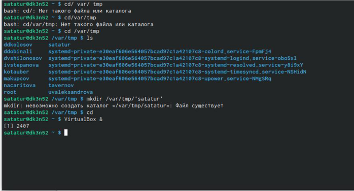
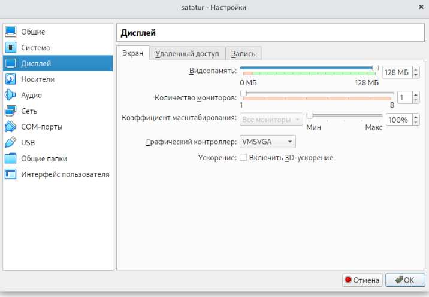
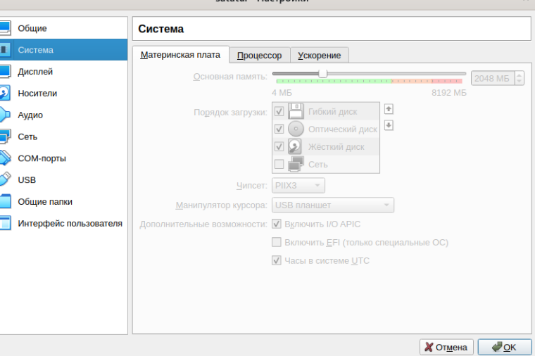
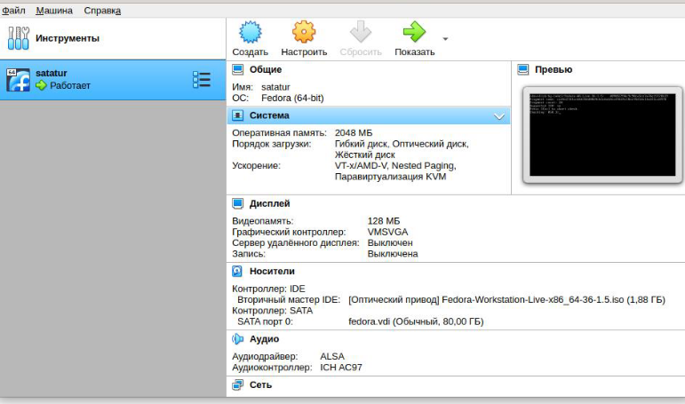
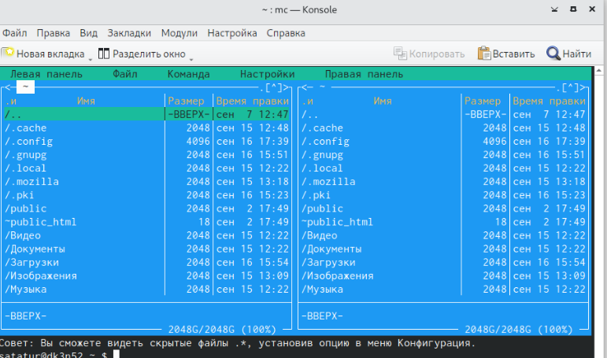
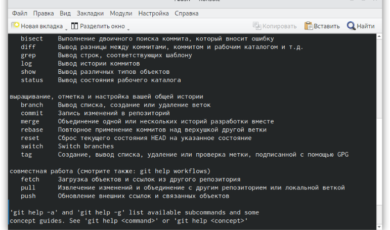
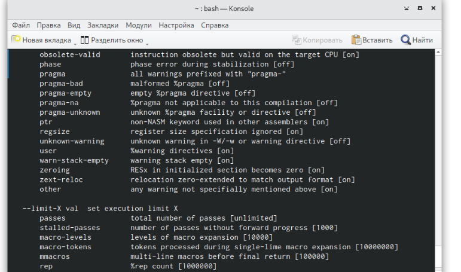
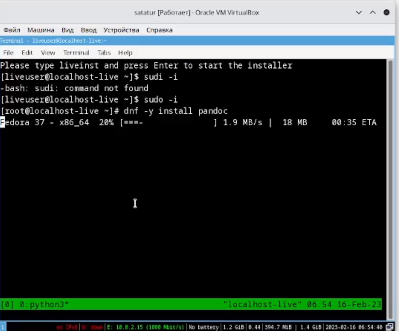

---
## Front matter
lang: ru-RU
title: Презентация к лабораторной работе №1
subtitle: 
author:
  - Кулябов Д. С.
institute:
  - Российский университет дружбы народов, Москва, Россия
  - Объединённый институт ядерных исследований, Дубна, Россия
date: 01 января 1970

## i18n babel
babel-lang: russian
babel-otherlangs: english

## Formatting pdf
toc: false
toc-title: Содержание
slide_level: 2
aspectratio: 169
section-titles: true
theme: metropolis
header-includes:
 - \metroset{progressbar=frametitle,sectionpage=progressbar,numbering=fraction}
 - '\makeatletter'
 - '\beamer@ignorenonframefalse'
 - '\makeatother'
---

# Информация

## Докладчик

:::::::::::::: {.columns align=center}
::: {.column width="70%"}

  * Татур Стефан Андреевич
  * Студент 1 курса
  * Российский университет дружбы народов
  * 1132226511@pfur.ru
  * <https://github.com/stefantatur>

:::
::: {.column width="30%"}


:::
::::::::::::::


# Создание презентации

Прежде всего я начал работу со встроенной коснолью. 


# После этого произвел базовую настройку






# Удостоверившись,что все работает я вышел из системы.



# Установка Midninght Commander (mc)



# Наличие системы Git. 





# Далее я перешел в аккаунт супер-пользователь,для того чтобы прописать команду sudo.

И установил пакеты pandoc,а также texlive.



## Процессор `pandoc`

- Pandoc: преобразователь текстовых файлов
- Сайт: <https://pandoc.org/>
- Репозиторий: <https://github.com/jgm/pandoc>

## Формат `pdf`

- Использование LaTeX
- Пакет для презентации: [beamer](https://ctan.org/pkg/beamer)
- Тема оформления: `metropolis`

## Код для формата `pdf`

```yaml
slide_level: 2
aspectratio: 169
section-titles: true
theme: metropolis
```

## Формат `html`

- Используется фреймворк [reveal.js](https://revealjs.com/)
- Используется [тема](https://revealjs.com/themes/) `beige`

## Код для формата `html`

- Тема задаётся в файле `Makefile`

```make
REVEALJS_THEME = beige 
```

## Получающиеся форматы

- Полученный `pdf`-файл можно демонстрировать в любой программе просмотра `pdf`
- Полученный `html`-файл содержит в себе все ресурсы: изображения, css, скрипты


## Актуальность

Знание языка программирования необходимо для построения карьеры в IT сфере.

## Итоговый слайд

Я получил практические навыки и научился работать с виртуальной машиной.

:::

