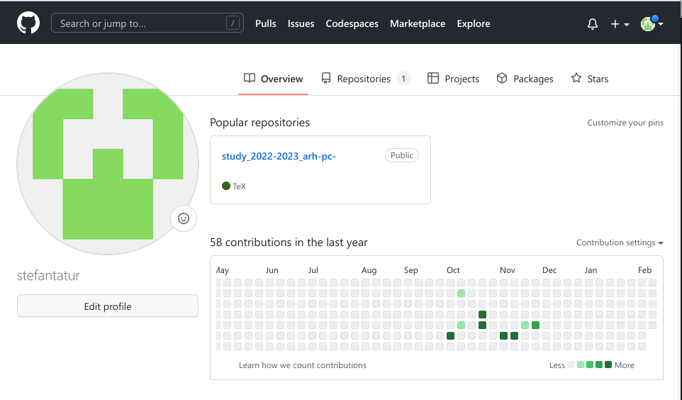
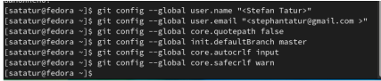
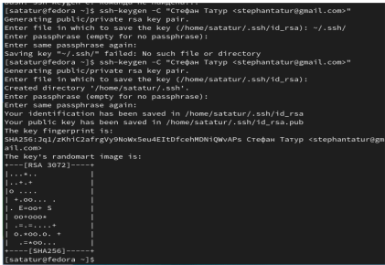
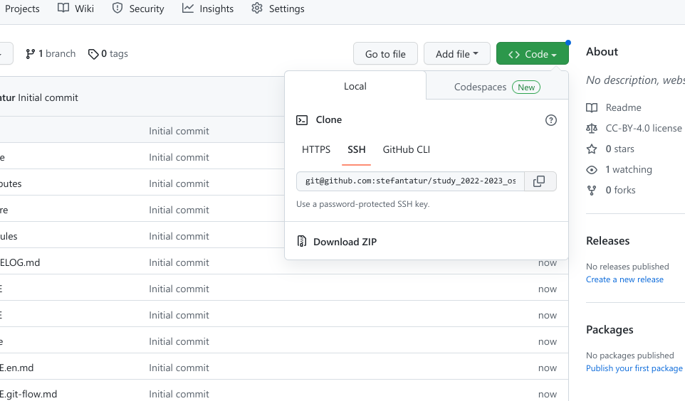
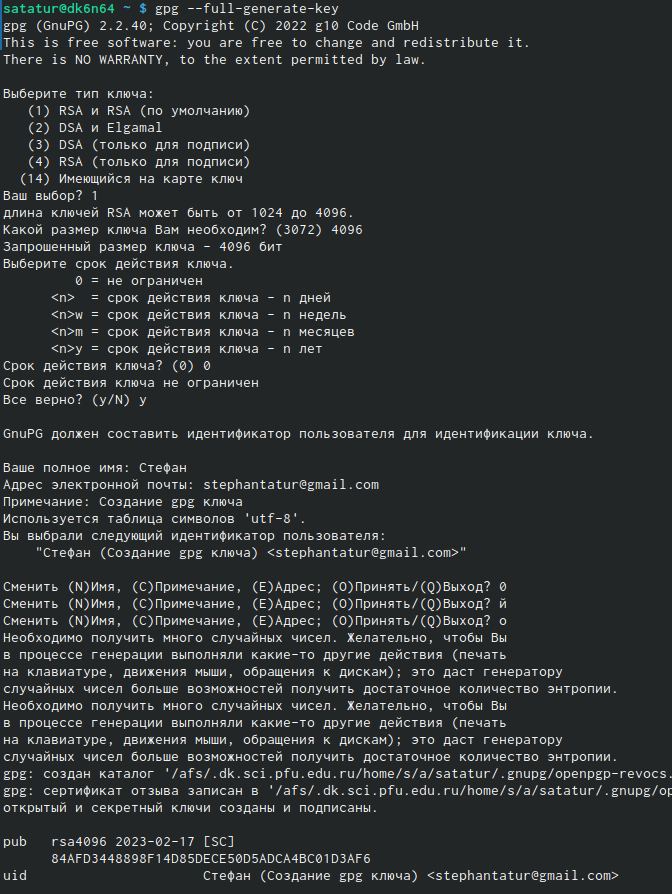
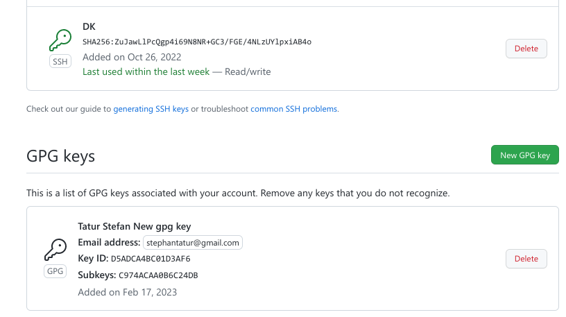
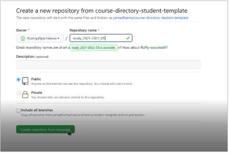
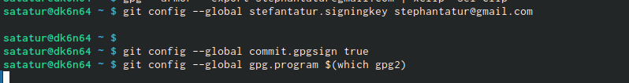
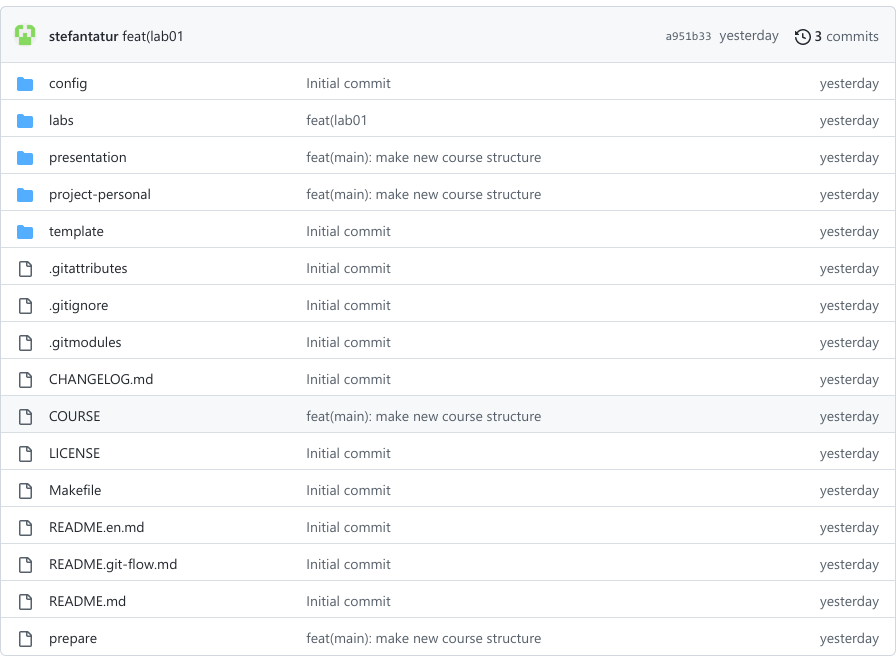

---
## Front matter
title: "Отчет по лабораторной работе №2"
subtitle: ""
author: "Татур Стефан Андреевич"

## Generic otions
lang: ru-RU
toc-title: "Содержание"

## Bibliography
bibliography: bib/cite.bib
csl: pandoc/csl/gost-r-7-0-5-2008-numeric.csl

## Pdf output format
toc: true # Table of contents
toc-depth: 2
lof: true # List of figures
lot: true # List of tables
fontsize: 12pt
linestretch: 1.5
papersize: a4
documentclass: scrreprt
## I18n polyglossia
polyglossia-lang:
  name: russian
  options:
	- spelling=modern
	- babelshorthands=true
polyglossia-otherlangs:
  name: english
## I18n babel
babel-lang: russian
babel-otherlangs: english
## Fonts
mainfont: PT Serif
romanfont: PT Serif
sansfont: PT Sans
monofont: PT Mono
mainfontoptions: Ligatures=TeX
romanfontoptions: Ligatures=TeX
sansfontoptions: Ligatures=TeX,Scale=MatchLowercase
monofontoptions: Scale=MatchLowercase,Scale=0.9
## Biblatex
biblatex: true
biblio-style: "gost-numeric"
biblatexoptions:
  - parentracker=true
  - backend=biber
  - hyperref=auto
  - language=auto
  - autolang=other*
  - citestyle=gost-numeric
## Pandoc-crossref LaTeX customization
figureTitle: "Рис."
tableTitle: "Таблица"
listingTitle: "Листинг"
lofTitle: "Список иллюстраций"
lotTitle: "Список таблиц"
lolTitle: "Листинги"
## Misc options
indent: true
header-includes:
  - \usepackage{indentfirst}
  - \usepackage{float} # keep figures where there are in the text
  - \floatplacement{figure}{H} # keep figures where there are in the text
---

# Цель работы
Изучить идеологию и применение средств контроля версий, освоить умения по работе с git.

# Выполнение лабораторной работы

1. Создаём учётную запись на github. 

2. Сделаем предварительную конфигурацию, указав имя и email владельца репозитория с помощью git config —global user.name"Имя Фамилия", git config —global user.email"work@mail".

После этого создаём новый ключ на github (команда ssh-keygen -C"Stefantatur <stephantatur@gmail.com> и привязываем его к копьютеру через консоль. После этого, скопировав из локальной консоли ключ в буфер обмена, вставляем ключ в появившееся на сайте поле.

3. Приступаем к базовой настройке git. Зададим имя и email владельца репозитория:  git config --global user.name "Name Surname" ,git config --global user.email "work@mail" . Настроим utf-8 в выводе сообщений git: git config --global core.quotepath false. Настроим верификацию и подписание коммитов git. Зададим имя начальной ветки: git config --global init.defaultBranch master. Параметр autocrlf:  git config --global core.autocrlf input. Параметр safecrlf: git config --global core.safecrlf warn.

4. Готовый Ssh-ключ на я github.

4.      Создаём ключ gpg: gpg --full-generate-key. Затем настраиваем: 
    • Тип RSA and RSA;
    • размер 4096; 
    • срок действия; значение по умолчанию— 0 (срок действия не истекает никогда). – 
    • Имя 
    • Адрес электронной почты. 
 

5. Добавлем PGP ключ в GitHub.  Используем gpg --list-secret-keys --keyid-format LONG. По образцу видим отпечаток моего ключа, вставляем его в следующую конструкцию:  gpg --armor --export <pgp Fingerprint> | xclip -sel clip. Затем перешли в настройки github и вставили полученный ключ

6. Готовые SSH и PGP ключи на github.

7. Затем настраиваем автоматические подписи коммитов git: git config --global user.signingkey,  git config --global commit.gpgsign truel, git config --global gpg.program $(which gpg2).

8. После этого создаём репозиторий курса на основе шаблона: 

9. Готовый репозиторий на github. 

# Выводы

Я изучил идеологию и научился применять средства контроля версий.

#Контрольные вопросы 

1). Система контроля версий Git представляетсобой набор программ командной строки.Доступ к ним можно получить изтерминала посредством ввода командыgitс различ-ными опциями. Системы контроля версий (Version Control System,VCS)применяются при работе нескольких человек над одним проектом.

2). В классических системах контроля версий используется централизованная модель, предполагающая наличие единого репозитория для хранения файлов. Выполнение большинства функций по управлению версиями осуществляется специальным сервером.Участник проекта (пользователь) перед началом работы посредством определённыхкоманд получает нужную ему версию файлов. После внесения изменений, пользователь размещает новую версию в хранилище. При этом предыдущие версии не удаляютсяиз центрального хранилища и к ним можно вернуться в любой момент. Сервер может сохранять неполную версию изменённых файлов, а производить так называемую дельта-компрессию—сохранять только изменения между последовательными версиями,чтопозволяет уменьшить объём хранимых данных.
Системы контроля версий также могут обеспечивать дополнительные, более гибкие функциональные возможности. Например,они могут поддерживать работу с
нескольки-ми версиями одного файла,сохраняя общую историю изменений до точки ветвления версий и собственные истории изменений каждой ветви. Крометого, обычно доступна информация о том, кто из участников, когда и какие изменения вносил. Обычно такого рода информация хранится в журнале изменений, доступ к которому можно ограничить.

3). Централизованные системы — это системы, которые используют архитектуру клиент / сервер, где один или несколько клиентских узлов напрямую подключены к центральному серверу. Пример - Wikipedia.
В децентрализованных системах каждый узел принимает свое собственное решение. Конечное поведение системы является совокупностью решений отдельных узлов. Пример — Bitcoin.
В классических системах контроля версий используется централизованная модель, предполагающая наличие единого репозитория для хранения файлов.Выполнение большинства функций по управлению версиями осуществляется специальным сервером.

4). Создадим локальный репозиторий. Сначала сделаем предварительную конфигурацию, указав имя и email владельца репозитория:
git config --global user.name"Имя Фамилия" git config --global user.email"work@mail"
и настроив utf-8 в выводе сообщенийgit:
git config --global quotepath false
Для инициализации локального репозитория, расположенного, например, в каталоге ~/tutorial, необходимо ввести в командной строке:
cd
mkdir tutorial
cd tutorial
git init

5). Для последующей идентификации пользователя на сервере репозиториев необходимо сгенерировать пару ключей (приватный и открытый): ssh-keygen -C"Имя Фамилия <work@mail>"
Ключи сохраняться в каталоге~/.ssh/.
Скопировав из локальной консоли ключ в буфер обмена
cat ~/.ssh/id_rsa.pub | xclip -sel clip
вставляем ключ в появившееся на сайте поле.

6). У Git две основных задачи: первая — хранить информацию о всех изменениях в вашем коде, начиная с самой первой строчки, а вторая — обеспечение удобства командной работы над кодом.

7). Основные команды git:
Наиболее часто используемые команды git: – создание основного дерева репозитория:git init–получение обновлений (изменений)текущего дерева из центрального репозитория:git pull–отправка всех произведённых изменений локального дерева в центральный репози-торий:git push–просмотр списка изменённых файлов втекущей директории:git status–просмотртекущих изменения:git diff–сохранениетекущих изменений:–добавить все изменённые и/или созданные файлы и/или каталоги:git add .–добавить конкретные изменённые и/или созданные файлы и/или каталоги:git add имена_файлов – удалить файл и/или каталог из индекса репозитория (приэтомфайл и/илик аталог остаётся в локальной директории): git rm имена_файлов – сохранение добавленных изменений: – сохранить все добавленные изменения и все изменённые файлы: git commit -am 'Описание коммита'–сохранить добавленные изменения с внесением комментария через встроенный редактор:git commit–создание новой ветки, базирующейся натекущей: git checkout -b имя_ветки–переключение на некоторую ветку: git checkout имя_ветки (при переключении на ветку, которой ещё нет в локальном репозитории, она будет создана и связана с удалённой) – отправка изменений конкретной ветки в центральный репозиторий: git push origin имя_ветки–слияние ветки стекущим деревом:git merge --no-ff имя_ветки–удаление ветки: – удаление локальной уже слитой с основным деревом ветки:git
branch -d имя_ветки–принудительное удаление локальной ветки:git branch -D имя_ветки–удаление ветки с центрального репозитория: git push origin :имя_ветки
8). Использования git при работе с локальными репозиториями (добавления текстового документа в локальный репозиторий):
git add hello.txt
git commit -am'Новый файл

9). Проблемы, которые решают ветки git:
· нужно постоянно создавать архивы с рабочим кодом
· сложно "переключаться" между архивами
· сложно перетаскивать изменения между архивами
· легко что-то напутать или потерять

10). Во время работы над проектомтак или иначе могутсоздаваться файлы,которые нетребуется добавлять в последствии в репозиторий. Например, временные файлы, со-здаваемые редакторами,или объектные файлы, создаваемые компиляторами.Можно прописать шаблоны игнорируемых при добавлении в репозиторийтипов файлов в файл.gitignore с помощьюс ервисов. Для этого сначала нужно получить списоки меющихся шаблонов: curl -L -s https://www.gitignore.io/api/list
Затем скачать шаблон,например, для C и C++
curl -L -s https://www.gitignore.io/api/c >> .gitignore
curl -L -s https://www.gitignore.io/api/c++ >> .gitignore

