---
## Front matter
lang: ru-RU
title: Лабораторная работа 4
subtitle: НММ-бд-03-22
author:
  - Татур Стефан
institute:
  - Российский университет дружбы народов, Москва, Россия

## i18n babel
babel-lang: russian
babel-otherlangs: english

## Formatting pdf
toc: false
toc-title: Содержание
slide_level: 2
aspectratio: 169
section-titles: true
theme: metropolis
header-includes:
 - \metroset{progressbar=frametitle,sectionpage=progressbar,numbering=fraction}
 - '\makeatletter'
 - '\beamer@ignorenonframefalse'
 - '\makeatother'
---

# Цель работы

Приобретение практических навыков взаимодействия пользователя с системой посредством командной строки.

# Создание презентации

##

Для начала определю полное имя моего домашнего каталога. Далее относительно этого каталога будут выполняться последующие упражнения.

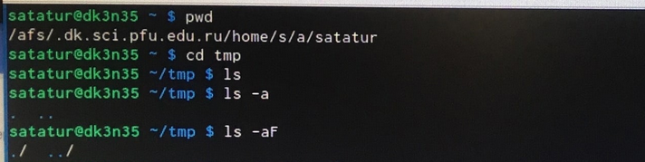{#fig:001 width=70%}

##

Далее перехожу в каталог /tmp.

{#fig:001 width=70%}

##

 1)Вывел на экран содержимое каталога /tmp. Для этого используовал команду ls.
 
 2)При использованиии команды ls с опцией - a получили вывод файлов находящихся в домашнем каталоге.
 
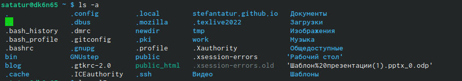{#fig:001 width=70%}
 
##

 3)При использованиии команды ls с опцией - alF получил более подробную информацию о файлах. Также видны файлы,которых не видно при использовании опции -a.
 
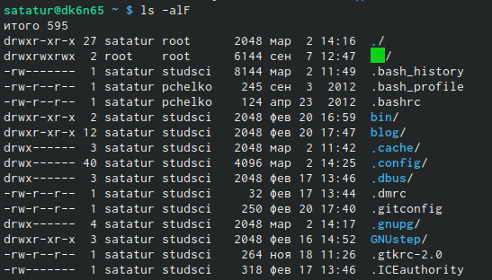{#fig:001 width=70%}

##

Определите, есть ли в каталоге /var/spool подкаталог с именем cron? - Да,есть. Нашел этот файл. Далее перешел в домашний каталог и вывел на экран его содержимое. Удостоверимся что я являюсь владельцем этих файлов прописав команду ls с опцией -alF.

{#fig:001 width=70%}

##

В домашнем каталоге создал новый каталог с именем newdir.

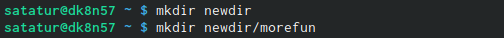{#fig:001 width=70%}

##

В каталоге ~/newdir создал новый каталог с именем morefun.

{#fig:001 width=70%}

##

В домашнем каталоге создал одной командой три новых каталога с именами
letters, memos, misk. Затем удалил эти каталоги одной командой.

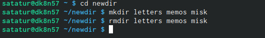{#fig:001 width=70%}

##

Попробовал удалить ранее созданный каталог ~/newdir командой rm. Но он не удалился,так как он не пустой. 

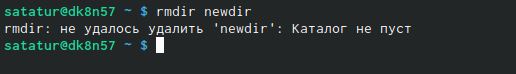{#fig:001 width=70%}

##

Удалил каталог ~/newdir/morefun из домашнего каталога. 

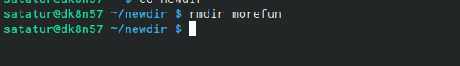{#fig:001 width=70%}

##

С помощью команды man -ls определил, какую опцию команды ls нужно использо-
вать для просмотра содержимое не только указанного каталога, но и подкаталогов,
входящих в него.

{#fig:001 width=70%}

##

С помощью команды man определил опцию команды ls, позволяющий отсорти-
ровать по времени последнего изменения выводимый список содержимого каталога
с развёрнутым описанием файлов.

{#fig:001 width=70%}

##

Использовал команду man для просмотра описания следующих команд: cd, pwd, mkdir,
rmdir, rm. Поясните основные опции этих команд.

## cd

{#fig:001 width=70%}

## pwd

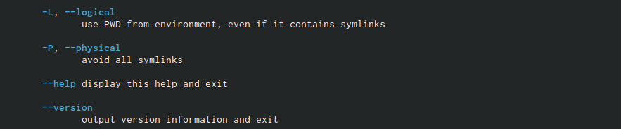{#fig:001 width=70%}

## mkdir

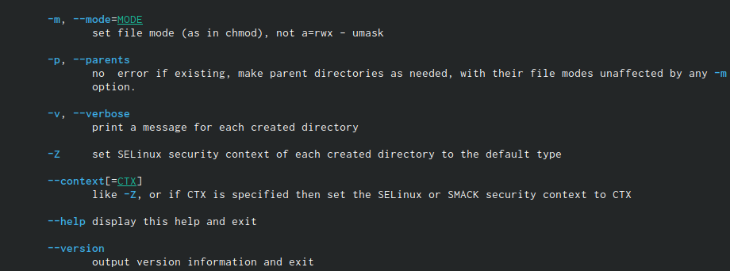{#fig:001 width=70%}

## rmdir

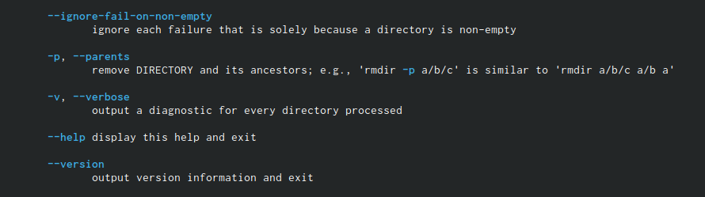{#fig:001 width=70%}

## rm

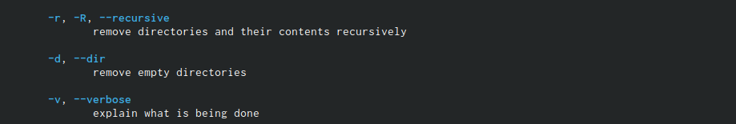{#fig:001 width=70%}

##

Используя информацию, полученную при помощи команды history, выполнил мо-
дификацию и исполнение команды из буфера команд.

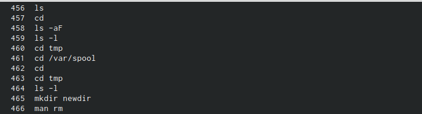{#fig:001 width=70%}

##

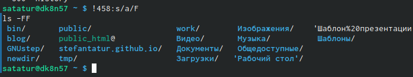{#fig:001 width=70%}

#Выводы

Освоил несколько новых команд и подробно разобрался в наборах опций этих команд.

:::

