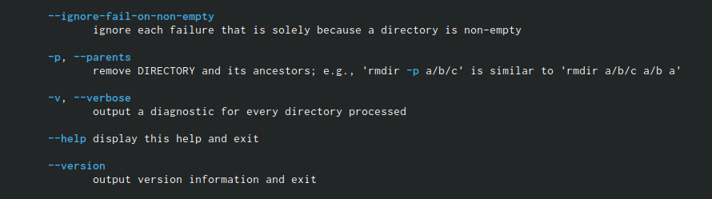

---
## Front matter
title: "Лабораторная работа 4"
subtitle: "НММ-бд-03-22"
author: "Татур Стефан"

## Generic otions
lang: ru-RU
toc-title: "Содержание"

## Bibliography
bibliography: bib/cite.bib
csl: pandoc/csl/gost-r-7-0-5-2008-numeric.csl

## Pdf output format
toc: true # Table of contents
toc-depth: 2
lof: true # List of figures
lot: true # List of tables
fontsize: 12pt
linestretch: 1.5
papersize: a4
documentclass: scrreprt
## I18n polyglossia
polyglossia-lang:
  name: russian
  options:
	- spelling=modern
	- babelshorthands=true
polyglossia-otherlangs:
  name: english
## I18n babel
babel-lang: russian
babel-otherlangs: english
## Fonts
mainfont: PT Serif
romanfont: PT Serif
sansfont: PT Sans
monofont: PT Mono
mainfontoptions: Ligatures=TeX
romanfontoptions: Ligatures=TeX
sansfontoptions: Ligatures=TeX,Scale=MatchLowercase
monofontoptions: Scale=MatchLowercase,Scale=0.9
## Biblatex
biblatex: true
biblio-style: "gost-numeric"
biblatexoptions:
  - parentracker=true
  - backend=biber
  - hyperref=auto
  - language=auto
  - autolang=other*
  - citestyle=gost-numeric
## Pandoc-crossref LaTeX customization
figureTitle: "Рис."
tableTitle: "Таблица"
listingTitle: "Листинг"
lofTitle: "Список иллюстраций"
lotTitle: "Список таблиц"
lolTitle: "Листинги"
## Misc options
indent: true
header-includes:
  - \usepackage{indentfirst}
  - \usepackage{float} # keep figures where there are in the text
  - \floatplacement{figure}{H} # keep figures where there are in the text
---

# Цель работы

Приобретение практических навыков взаимодействия пользователя с системой по-
средством командной строки.

# Выполнение лабораторной работы

1. Для начала определю полное имя моего домашнего каталога. Далее относительно этого ката-
лога будут выполняться последующие упражнения.

{#fig:001 width=70%}

2. Далее перехожу в каталог /tmp.

{#fig:001 width=70%}

 1)Вывел на экран содержимое каталога /tmp. Для этого используовал команду ls.
 
 2)При использованиии команды ls с опцией - a получили вывод файлов находящихся в домашнем каталоге.
 
{#fig:001 width=70%}
 
 3)При использованиии команды ls с опцией - alF получил более подробную информацию о файлах. Также видны файлы,которых не видно при использовании опции -a.
 
{#fig:001 width=70%}

3. Определите, есть ли в каталоге /var/spool подкаталог с именем cron? - Да,есть. Нашел этот файл. Далее перешел в домашний каталог и вывел на экран его содержимое. Удостоверимся что я являюсь владельцем этих файлов прописав команду ls с опцией -alF.

{#fig:001 width=70%}

4. В домашнем каталоге создал новый каталог с именем newdir.

{#fig:001 width=70%}

5. В каталоге ~/newdir создал новый каталог с именем morefun.

{#fig:001 width=70%}

6. В домашнем каталоге создал одной командой три новых каталога с именами
letters, memos, misk. Затем удалил эти каталоги одной командой.

{#fig:001 width=70%}

7. Попробовал удалить ранее созданный каталог ~/newdir командой rm. Но он не удалился,так как он не пустой. 

{#fig:001 width=70%}

8. Удалил каталог ~/newdir/morefun из домашнего каталога. 

{#fig:001 width=70%}

9. С помощью команды man -ls определил, какую опцию команды ls нужно использо-
вать для просмотра содержимое не только указанного каталога, но и подкаталогов,
входящих в него.

{#fig:001 width=70%}

10. С помощью команды man определил опцию команды ls, позволяющий отсорти-
ровать по времени последнего изменения выводимый список содержимого каталога
с развёрнутым описанием файлов.

{#fig:001 width=70%}

11. Использовал команду man для просмотра описания следующих команд: cd, pwd, mkdir,
rmdir, rm. Поясните основные опции этих команд.

12. cd

{#fig:001 width=70%}

13. pwd

{#fig:001 width=70%}

14. mkdir

{#fig:001 width=70%}

15. rmdir

{#fig:001 width=70%}

16. rm

{#fig:001 width=70%}

17. Используя информацию, полученную при помощи команды history, выполнил мо-
дификацию и исполнение команды из буфера команд.

{#fig:001 width=70%}

{#fig:001 width=70%}

# Выводы

Освоил несколько новых команд и подробно разобрался в наборах опций этих команд.

::: {#refs}
:::
