---
## Front matter
lang: ru-RU
title: Лабораторная номер 7 
subtitle: Презентация
author:
  - Татур Стефан Андреевич
institute:
  - Российский университет дружбы народов, Москва, Россия
date: 23 марта 2023

## i18n babel
babel-lang: russian
babel-otherlangs: english

## Formatting pdf
toc: false
toc-title: Содержание
slide_level: 2
aspectratio: 169
section-titles: true
theme: metropolis
header-includes:
 - \metroset{progressbar=frametitle,sectionpage=progressbar,numbering=fraction}
 - '\makeatletter'
 - '\beamer@ignorenonframefalse'
 - '\makeatother'
---

# Информация

:::
::: {.column width="30%"}

:::
::::::::::::::


## Материалы и методы

- Процессор `pandoc` для входного формата Markdown
- Результирующие форматы
	- `pdf`
	- `html`
- Автоматизация процесса создания: `Makefile`

# Создание презентации

# Цель работы

Освоение основных возможностей командной оболочки Midnight Commander. Приобретение навыков практической работы по просмотру каталогов и файлов; манипуляций с ними.

# Выполнение лабораторной работы

## Задание по mc. Изучаем информацию о mc, вызвав в командной строке man mc.

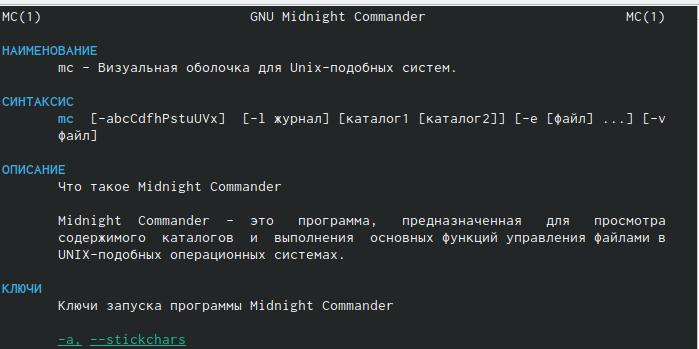{#fig:001 width=70%}

## Запустим из командной строки mc и изучим его структуру и меню. Видим, что верхнее меню содержит “Левая панель”, “Файл”, “Команда”, “Настройки”, “Правая панель”. Также, начав клавиши F1 и F2 мы можем открыть “Помощь” или “Меню пользователя”.

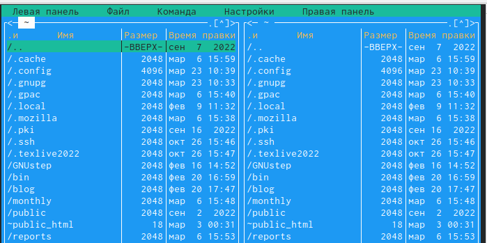{#fig:001 width=70%} 

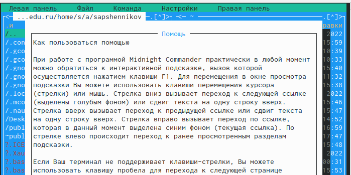{#fig:001 width=70%} 

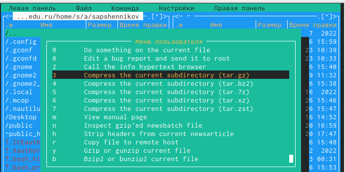{#fig:001 width=70%} 

## Выполним несколько операций в mc. Выделение и отмена выделения файлов. Для этого используем “shift”+стрелку вниз.

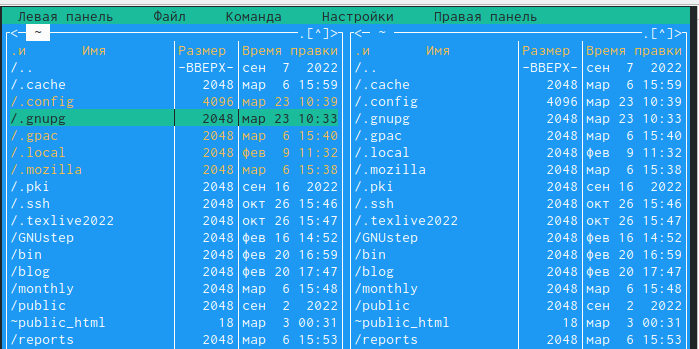{#fig:001 width=70%} 

## Копирование и перемещение файлов. Для копирования используем клафишу “F5”, а для перемещения “F6”.
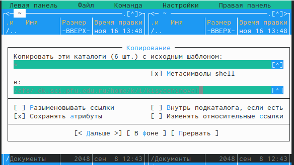{#fig:001 width=70%} 

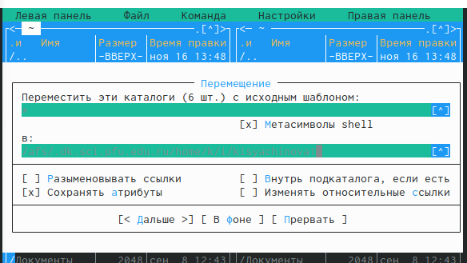{#fig:001 width=70%} 

## После этого выполним команду для получения информации о размерах и правах доступа на файлы и/или каталоги. Это делаем таким путём: “Левая панель”-“Информация”.

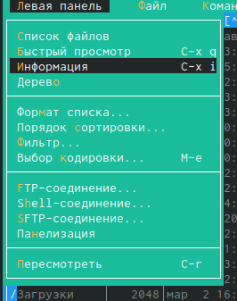{#fig:001 width=70%} 

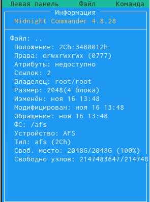{#fig:001 width=70%} 

## Выполним основные команды меню левой панели.

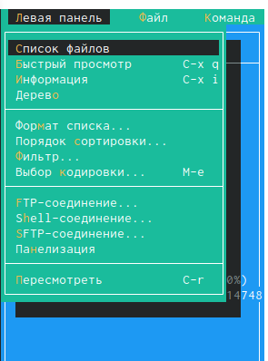{#fig:001 width=70%} 

## "Список файлов” отображает размер файла и время его правки.

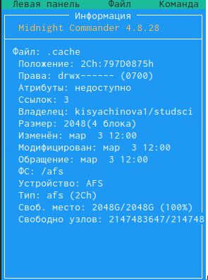{#fig:001 width=70%} 


## Быстрый просмотр” необходим для просмотра сожержания файлов. Пункт “Информация” отображает подробные данные для о файле.

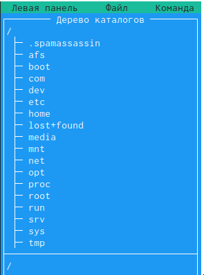{#fig:001 width=70%} 

## Пункт “Дерево” необходим для просмотра дерева каталога.

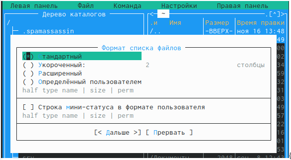{#fig:001 width=70%}

“Формат списка” 

    “Укороченный” отображает только имя файла или каталога.

    “Расширенный” отображает подробную информацию о файлах.

    ”Определённый пользователем” даёт возможность самостоятельно изменять степень подробнотио файле.

    “Стандартный” ставится по умолчанию.
    
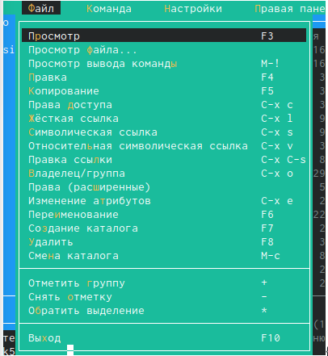{#fig:001 width=70%}

## Пункт “Фильтр” необходим для того, чтобы просмотреть название файлов или каталогов, которые подходят под указанную маску.

“Порядок сортировки” необходим для сортировки файлов ил каталогов по конкретному критерию.

## С помощью фозможностей подменю “Файл” выполним следующие действия.

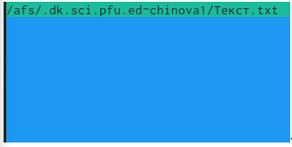{#fig:001 width=70%}

## Для просмотра содержимого файла выберем пункт “Просмотр файла”.

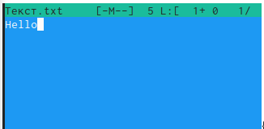{#fig:001 width=70%}

## Для редактирования содержимого текстового файла перейдём в пункт “Правка” и изменим на “Hello”

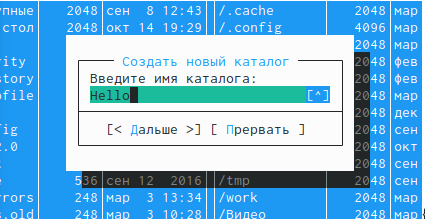{#fig:001 width=70%}

## Для создания каталога переходим в пункт “Создание каталога”. Я создам каталог “Hello”

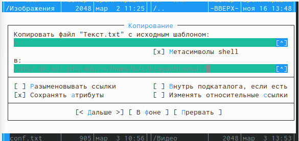{#fig:001 width=70%}

## Копирование файлов в созданный каталог происходит с помощью выбора пункта “Копирование”. Выделим несколько файлов и пернесём их в каталог.

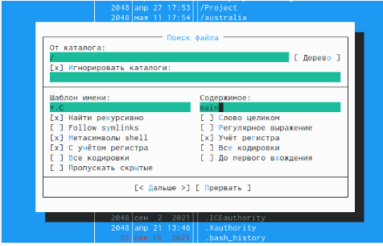{#fig:001 width=70%}

## С помощью средств подменю “Команда” осуществим следующие действия:поиск в файловой системе файла с заданными условия. Задаим условия “От каталога /,”Шаблон имени”*.сpp, “Содержимое”main. 

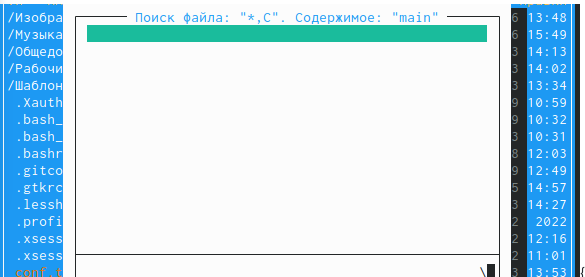{#fig:001 width=70%}

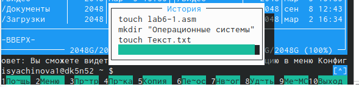{#fig:001 width=70%}

## Затем для выбора и повторения одной из предыдущих комнад перейдём в “История командной строки”-“История” внизу экрана, но это сноска пустая, т.к. не была использована командная строка.

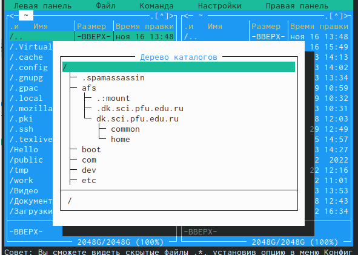{#fig:001 width=70%}

## Для перехода в домашний каталог переходим в пункт “Дерево каталогов” и выбираем необходимый каталог. 

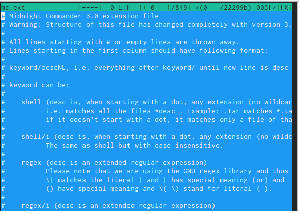{#fig:001 width=70%}

## Для анализа файла меню и файла расширение переходим в пункт “Редактировать файл расширений

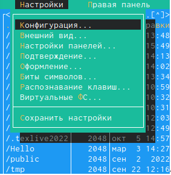{#fig:001 width=70%}

## Вызовем подменю “Найстройки”. Освоим операции: “Конфигурация” позволяет скорректировать найстройки работы с панелями. “Внешний вид”- “Настрйока панелей” помогают определить элементы, отображаемые при вызове mc. Пункт “Подтеждение” помогаем установить или убрать вывод окна с хапросом подтверждения действий при операциях удаления и перезаписи файлов. Пунк “Оформление” даёт возможность менять цветовую гамму визуальной оболочки. А с помощью пункта “Сохранить настройки” сохраняем изменения.

{#fig:001 width=70%}

# Выводы

В процессе выполнения лабораторной работы я освоила основные возможности командной оболочки Midnight Commander. Приобрила навыки практической работы по просмотру каталогов и файлов; манипуляций с ними.

## Процессор `pandoc`

- Pandoc: преобразователь текстовых файлов
- Сайт: <https://pandoc.org/>
- Репозиторий: <https://github.com/jgm/pandoc>

## Формат `pdf`

- Использование LaTeX
- Пакет для презентации: [beamer](https://ctan.org/pkg/beamer)
- Тема оформления: `metropolis`

## Код для формата `pdf`

```yaml
slide_level: 2
aspectratio: 169
section-titles: true
theme: metropolis
```

## Формат `html`

- Используется фреймворк [reveal.js](https://revealjs.com/)
- Используется [тема](https://revealjs.com/themes/) `beige`

## Код для формата `html`

- Тема задаётся в файле `Makefile`

```make
REVEALJS_THEME = beige 
```
# Результаты

## Получающиеся форматы

- Полученный `pdf`-файл можно демонстрировать в любой программе просмотра `pdf`
- Полученный `html`-файл содержит в себе все ресурсы: изображения, css, скрипты

# Элементы презентации

## Актуальность

- Даёт понять, о чём пойдёт речь
- Следует широко и кратко описать проблему
- Мотивировать свое исследование
- Сформулировать цели и задачи
- Возможна формулировка ожидаемых результатов

## Цели и задачи

- Не формулируйте более 1--2 целей исследования

## Материалы и методы

- Представляйте данные качественно
- Количественно, только если крайне необходимо
- Излишние детали не нужны

## Содержание исследования

- Предлагаемое решение задач исследования с обоснованием
- Основные этапы работы

## Результаты

- Не нужны все результаты
- Необходимы логические связки между слайдами
- Необходимо показать понимание материала


## Итоговый слайд

- Запоминается последняя фраза. © Штирлиц
- Главное сообщение, которое вы хотите донести до слушателей
- Избегайте использовать последний слайд вида *Спасибо за внимание*

# Рекомендации

## Принцип 10/20/30

  - 10 слайдов
  - 20 минут на доклад
  - 30 кегль шрифта

## Связь слайдов

::: incremental

- Один слайд --- одна мысль
- Нельзя ссылаться на объекты, находящиеся на предыдущих слайдах (например, на формулы)
- Каждый слайд должен иметь заголовок

:::

## Количество сущностей

::: incremental

- Человек может одновременно помнить $7 \pm 2$ элемента
- При размещении информации на слайде старайтесь чтобы в сумме слайд содержал не более 5 элементов
- Можно группировать элементы так, чтобы визуально было не более 5 групп

:::

## Общие рекомендации

::: incremental

- На слайд выносится та информация, которая без зрительной опоры воспринимается хуже
- Слайды должны дополнять или обобщать содержание выступления или его частей, а не дублировать его
- Информация на слайдах должна быть изложена кратко, чётко и хорошо структурирована
- Слайд не должен быть перегружен графическими изображениями и текстом
- Не злоупотребляйте анимацией и переходами

:::

## Представление данных

::: incremental

- Лучше представить в виде схемы
- Менее оптимально представить в виде рисунка, графика, таблицы
- Текст используется, если все предыдущие способы отображения информации не подошли

:::

