---
## Front matter
title: "Лабораторная номер 7"
subtitle: "Отчет по выполнению"
author: "Татур Стефан Андреевич"

## Generic otions
lang: ru-RU
toc-title: "Содержание"

## Bibliography
bibliography: bib/cite.bib
csl: pandoc/csl/gost-r-7-0-5-2008-numeric.csl

## Pdf output format
toc: true # Table of contents
toc-depth: 2
lof: true # List of figures
lot: true # List of tables
fontsize: 12pt
linestretch: 1.5
papersize: a4
documentclass: scrreprt
## I18n polyglossia
polyglossia-lang:
  name: russian
  options:
	- spelling=modern
	- babelshorthands=true
polyglossia-otherlangs:
  name: english
## I18n babel
babel-lang: russian
babel-otherlangs: english
## Fonts
mainfont: PT Serif
romanfont: PT Serif
sansfont: PT Sans
monofont: PT Mono
mainfontoptions: Ligatures=TeX
romanfontoptions: Ligatures=TeX
sansfontoptions: Ligatures=TeX,Scale=MatchLowercase
monofontoptions: Scale=MatchLowercase,Scale=0.9
## Biblatex
biblatex: true
biblio-style: "gost-numeric"
biblatexoptions:
  - parentracker=true
  - backend=biber
  - hyperref=auto
  - language=auto
  - autolang=other*
  - citestyle=gost-numeric
## Pandoc-crossref LaTeX customization
figureTitle: "Рис."
tableTitle: "Таблица"
listingTitle: "Листинг"
lofTitle: "Список иллюстраций"
lotTitle: "Список таблиц"
lolTitle: "Листинги"
## Misc options
indent: true
header-includes:
  - \usepackage{indentfirst}
  - \usepackage{float} # keep figures where there are in the text
  - \floatplacement{figure}{H} # keep figures where there are in the text
---

# Цель работы

Освоение основных возможностей командной оболочки Midnight Commander. Приобретение навыков практической работы по просмотру каталогов и файлов; манипуляций с ними.

# Выполнение лабораторной работы

1. Задание по mc. Изучаем информацию о mc, вызвав в командной строке man mc.

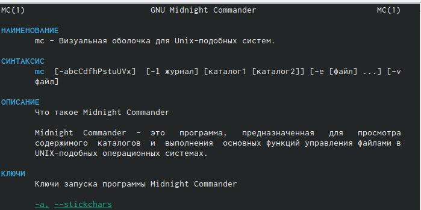{#fig:001 width=70%}

2. Запустим из командной строки mc и изучим его структуру и меню. Видим, что верхнее меню содержит “Левая панель”, “Файл”, “Команда”, “Настройки”, “Правая панель”. Также, начав клавиши F1 и F2 мы можем открыть “Помощь” или “Меню пользователя”.

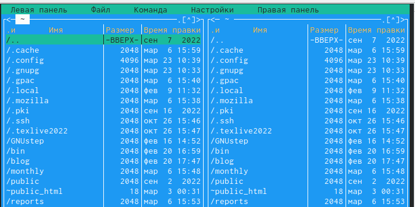{#fig:001 width=70%} 

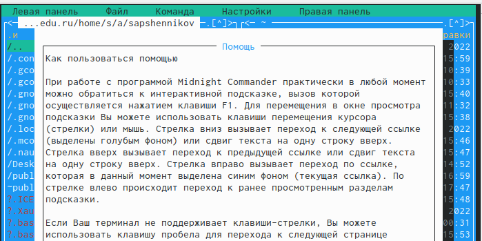{#fig:001 width=70%} 

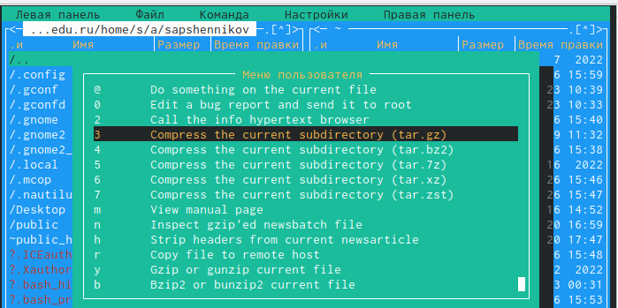{#fig:001 width=70%} 

3. Выполним несколько операций в mc. Выделение и отмена выделения файлов. Для этого используем “shift”+стрелку вниз.

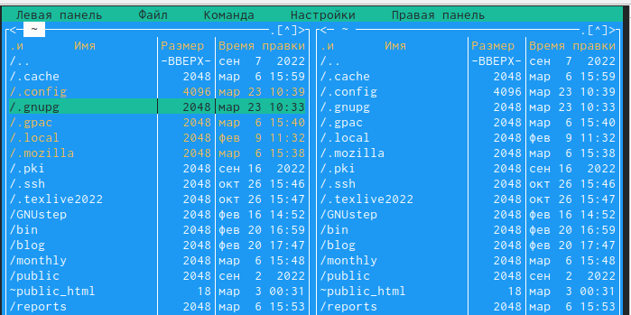{#fig:001 width=70%} 

4. Копирование и перемещение файлов. Для копирования используем клафишу “F5”, а для перемещения “F6”.
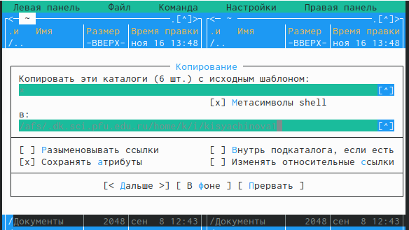{#fig:001 width=70%} 

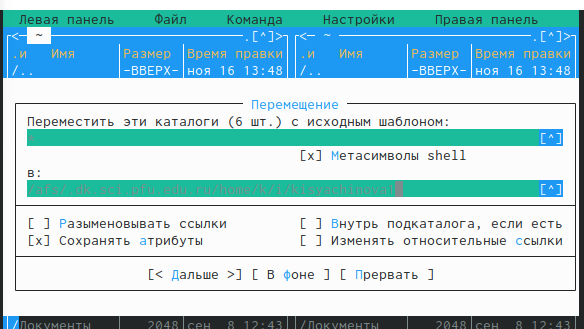{#fig:001 width=70%} 

5. После этого выполним команду для получения информации о размерах и правах доступа на файлы и/или каталоги. Это делаем таким путём: “Левая панель”-“Информация”.

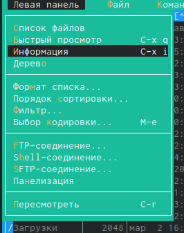{#fig:001 width=70%} 

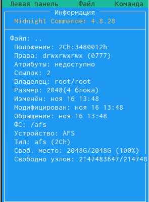{#fig:001 width=70%} 

6. Выполним основные команды меню левой панели.

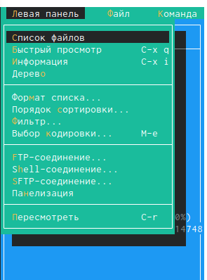{#fig:001 width=70%} 

7. "Список файлов” отображает размер файла и время его правки.

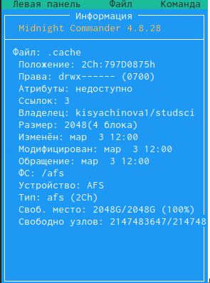{#fig:001 width=70%} 

8. Быстрый просмотр” необходим для просмотра сожержания файлов. Пункт “Информация” отображает подробные данные для о файле.

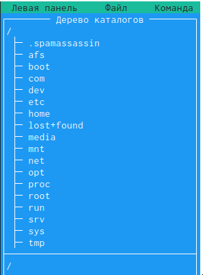{#fig:001 width=70%} 

9. Пункт “Дерево” необходим для просмотра дерева каталога.

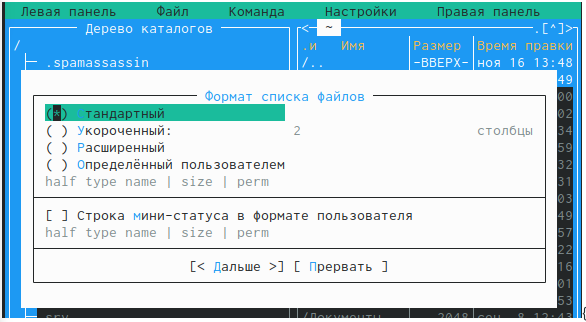{#fig:001 width=70%}

“Формат списка” 

    “Укороченный” отображает только имя файла или каталога.

    “Расширенный” отображает подробную информацию о файлах.

    ”Определённый пользователем” даёт возможность самостоятельно изменять степень подробнотио файле.

    “Стандартный” ставится по умолчанию.
    
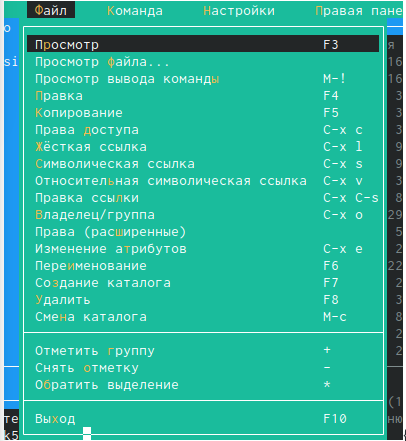{#fig:001 width=70%}

Пункт “Фильтр” необходим для того, чтобы просмотреть название файлов или каталогов, которые подходят под указанную маску.

“Порядок сортировки” необходим для сортировки файлов ил каталогов по конкретному критерию.

10. С помощью фозможностей подменю “Файл” выполним следующие действия.

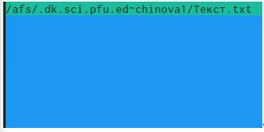{#fig:001 width=70%}

Для просмотра содержимого файла выберем пункт “Просмотр файла”.

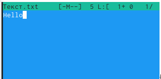{#fig:001 width=70%}

Для редактирования содержимого текстового файла перейдём в пункт “Правка” и изменим на “Hello”

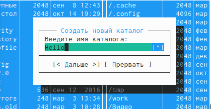{#fig:001 width=70%}

Для создания каталога переходим в пункт “Создание каталога”. Я создам каталог “Hello”

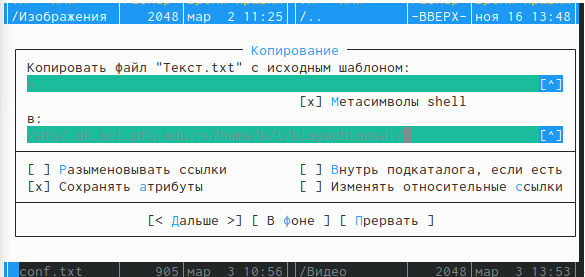{#fig:001 width=70%}

Копирование файлов в созданный каталог происходит с помощью выбора пункта “Копирование”. Выделим несколько файлов и пернесём их в каталог.

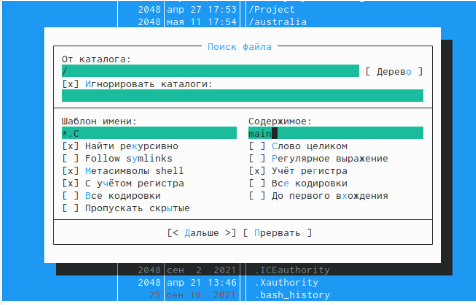{#fig:001 width=70%}

11. С помощью средств подменю “Команда” осуществим следующие действия:поиск в файловой системе файла с заданными условия. Задаим условия “От каталога /,”Шаблон имени”*.сpp, “Содержимое”main. 

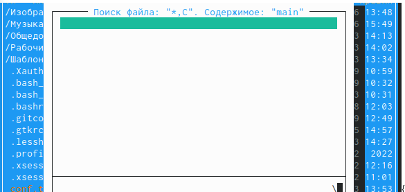{#fig:001 width=70%}

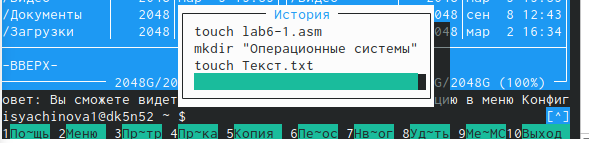{#fig:001 width=70%}

Затем для выбора и повторения одной из предыдущих комнад перейдём в “История командной строки”-“История” внизу экрана, но это сноска пустая, т.к. не была использована командная строка.

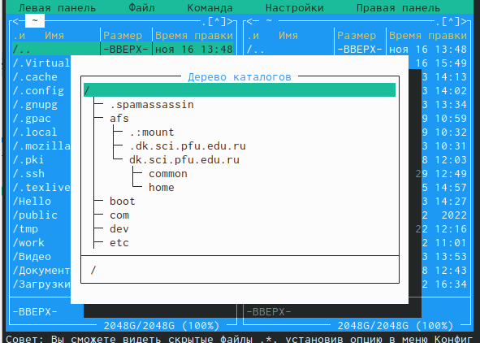{#fig:001 width=70%}

Для перехода в домашний каталог переходим в пункт “Дерево каталогов” и выбираем необходимый каталог. 

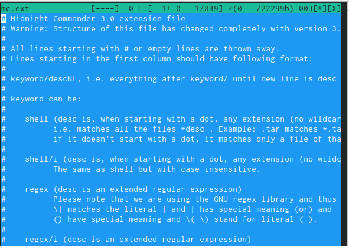{#fig:001 width=70%}

Для анализа файла меню и файла расширение переходим в пункт “Редактировать файл расширений

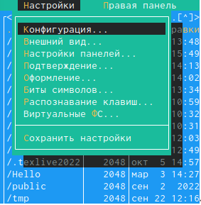{#fig:001 width=70%}

12. Вызовем подменю “Найстройки”. Освоим операции: “Конфигурация” позволяет скорректировать найстройки работы с панелями. “Внешний вид”- “Настрйока панелей” помогают определить элементы, отображаемые при вызове mc. Пункт “Подтеждение” помогаем установить или убрать вывод окна с хапросом подтверждения действий при операциях удаления и перезаписи файлов. Пунк “Оформление” даёт возможность менять цветовую гамму визуальной оболочки. А с помощью пункта “Сохранить настройки” сохраняем изменения.

{#fig:001 width=70%}

# Выводы

В процессе выполнения лабораторной работы я освоила основные возможности командной оболочки Midnight Commander. Приобрила навыки практической работы по просмотру каталогов и файлов; манипуляций с ними.

::: {#refs}
:::
