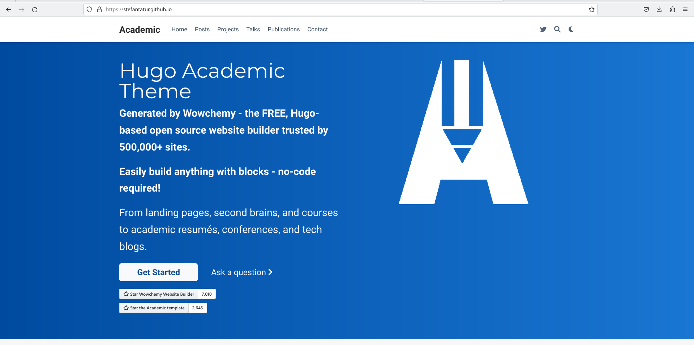

---
## Front matter
title: "Отчет индивидуальный проект"
subtitle: "Этап 1"
author: "Татур Стефан Андреевич"

## Generic otions
lang: ru-RU
toc-title: ""

## Bibliography
bibliography: bib/cite.bib
csl: pandoc/csl/gost-r-7-0-5-2008-numeric.csl

## Pdf output format
toc: true # Table of contents
toc-depth: 2
lof: true # List of figures
lot: true # List of tables
fontsize: 12pt
linestretch: 1.5
papersize: a4
documentclass: scrreprt
## I18n polyglossia
polyglossia-lang:
  name: russian
  options:
	- spelling=modern
	- babelshorthands=true
polyglossia-otherlangs:
  name: english
## I18n babel
babel-lang: russian
babel-otherlangs: english
## Fonts
mainfont: PT Serif
romanfont: PT Serif
sansfont: PT Sans
monofont: PT Mono
mainfontoptions: Ligatures=TeX
romanfontoptions: Ligatures=TeX
sansfontoptions: Ligatures=TeX,Scale=MatchLowercase
monofontoptions: Scale=MatchLowercase,Scale=0.9
## Biblatex
biblatex: true
biblio-style: "gost-numeric"
biblatexoptions:
  - parentracker=true
  - backend=biber
  - hyperref=auto
  - language=auto
  - autolang=other*
  - citestyle=gost-numeric
## Pandoc-crossref LaTeX customization
figureTitle: "Рис."
tableTitle: "Таблица"
listingTitle: "Листинг"
lofTitle: "Список иллюстраций"
lotTitle: "Список таблиц"
lolTitle: "Листинги"
## Misc options
indent: true
header-includes:
  - \usepackage{indentfirst}
  - \usepackage{float} # keep figures where there are in the text
  - \floatplacement{figure}{H} # keep figures where there are in the text
---

# Цель работы

Создать необходимые каталоги и переместить их на github. Далее подготовить рабочее пространство для дальнейшей работы с сайтом.

# Выполнение лабораторной работы

1. Для начала установим архив hugo подходящей для нас версии. У меня это архив hugo extended для linux (64 bit). 

{#fig:001 width=70%}

2. После установки распаковываем архив и вырезаем файл hugo. Создаем в домашнем каталоге файл "bin".

{#fig:001 width=70%}

3. Копируем шаблон репозитория,предоставленного по ссылке и создаем репозиторий под названием blog на github.

{#fig:001 width=70%}

4. Клонируем репозиторий при помощи команды recursive.

{#fig:001 width=70%}

5. Просматриваем наши файлы.

{#fig:001 width=70%}

6. Далее перейдя в hugo удаляем файл public.

{#fig:001 width=70%}

7. Прописываем ~/bin/hugo server чтобы получить ссылку на наш сайт.

{#fig:001 width=70%}

8. Перед нами сайт который пока не видно с других устройств. Мы можем посмотреть его только с нашего компьютера.

{#fig:001 width=70%}

9. Перенесем наш сайт в репозиторий на github. Для этого создадим новый репозиторий с именем study_2022-2023_os.intro.

{#fig:001 width=70%}

10. Выводим наши файлы,чтобы убедиться что все установилось правильно и аналогично с предыдущим,клоинируем репозиторий с github на наш компьютер.

{#fig:001 width=70%}

11. Выполняем команду git checkout -b main и спомощью нее создаем новую ветку.

{#fig:001 width=70%}

12. Добавляем пустой файл README.md. И закидываем на github.

{#fig:001 width=70%}

{#fig:001 width=70%}

13. Перейдем в blog и выполняем команду которая подключит наш репозиторий к папке public внутри нашего блока.

{#fig:001 width=70%}

14. Появилась ошибка которую мы устраним прокоментировав public в папке gitignore.

{#fig:001 width=70%}

15. Повторяем команду. Все работает!

{#fig:001 width=70%}

16. Готовая папка public на компьютере.

{#fig:001 width=70%}

17. Убедимся что каталог public подключен к репозиторию.

{#fig:001 width=70%}

18. Далее закидываем все наши файлы на github.

{#fig:001 width=70%}

19. Готовый репозиторий. 

{#fig:001 width=70%}

20. Сайт.

{#fig:001 width=70%}

# Выводы

Создал персональный сайт. Создал рабочее пространство и репозитории.Удалил лишние файлы.Подключил каталог public к репозиторию.

:::
